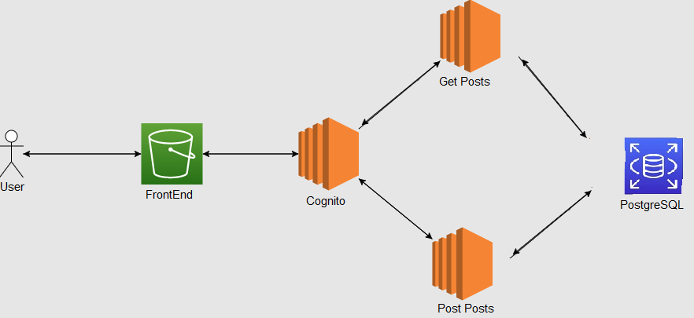

# Titulo

Monolito AWS Cognito

## Descripción

En este repositorio encontrará una aplicacion con la siguiente arquitectura:



En la arquitectura vemos como tenemos una s3 con el servidor web, de ahi parte al centro de nuestros apis y el que orquesta el cognito con jwt, luego tenemos un api para post y otro para get, estos dos se conectan a una base de datos.

### Prerrequisitos

Para correr este se debe tener instalado:

- Maven
- Java
- Node

### Guía de uso

El proyecto tiene 4 servicios que se deben correr en orden:

1. Get
2. Post
3. Cognito
4. Frontend

**Nota**: Para poder correr cada uno debe usar java para los primeros 3 y node para el ultimo.

### Video Demostrativo

Puede encontrar un video demostrativo de la aplicación funcionando en el siguiente link:

[Video Demostrativo](./media/funcionamientoVideo.mp4)

## Autor

- **Juan Carlos Baez Lizarazo** - [juanbaezl](https://github.com/juanbaezl)
- **Nicolas Palacios** - [nicolaspalacios-f](https://github.com/nicolaspalacios-f)

## Fecha

Noviembre, 2022

## Licencia

Para más información ver: [LICENSE.txt](License.txt)

```

```
